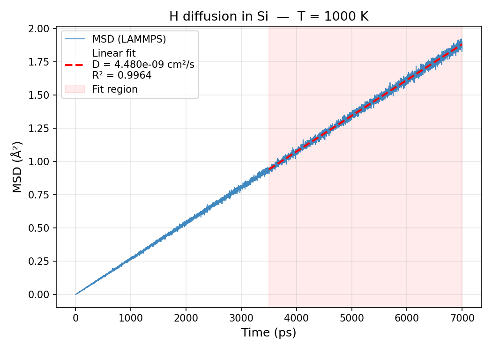
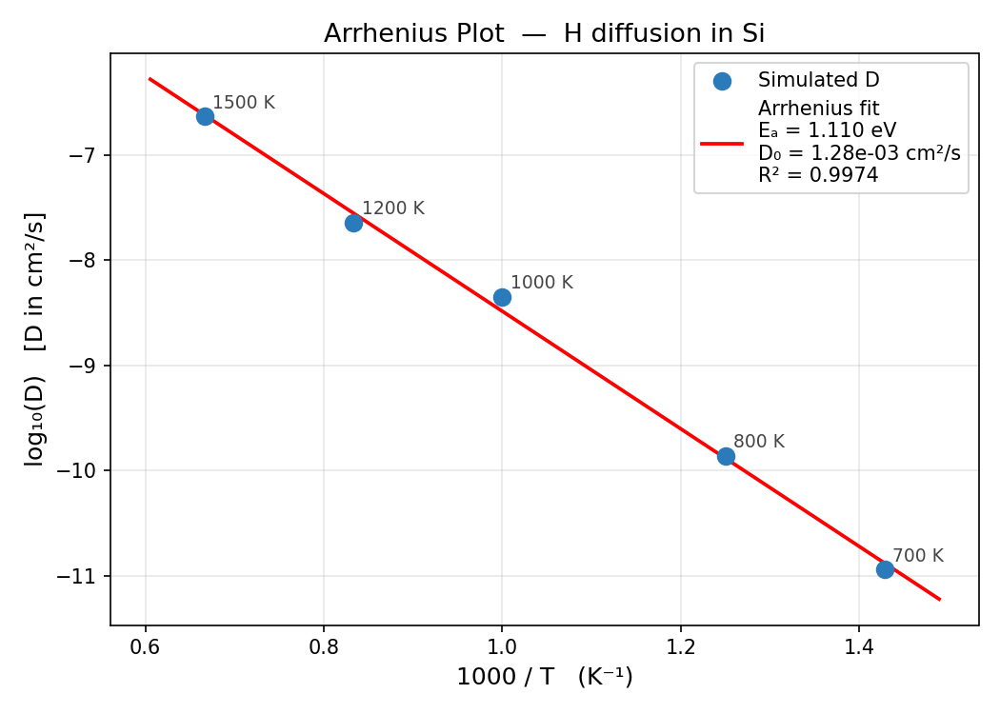

# H Diffusion in Si

Molecular dynamics study of hydrogen diffusion in a silicon slab using the
**GRACE-1L-OAM** machine-learning interatomic potential.

Full workflow: structure preparation → automated multi-temperature NVT simulations
→ MSD analysis → Arrhenius activation energy extraction.

---

## Quick Start

### No LAMMPS installed?

The repository includes synthetic placeholder MSD data so you can run and
inspect the full analysis pipeline immediately.

```bash
# 1. Set up the conda environment
conda env create -f grace.yml
conda activate lammps_grace_env

# 2. Run the analysis on the placeholder data
python analyze_msd.py --presimulated
# → output written to results_presimulated/
```

### Have LAMMPS + GRACE installed?

```bash
# 1. Set up the conda environment
conda env create -f grace.yml
conda activate lammps_grace_env

# 2. Verify and save LAMMPS + GRACE paths  ← always run this first
python check_environment.py

# 3. Launch simulations
python run_diffusion.py

# 4. Monitor progress
chmod +x monitor_jobs.sh
./monitor_jobs.sh --watch

# 5. After all jobs finish
python analyze_msd.py
```

---

## System

| Property | Value |
|---|---|
| Composition | 64 Si + 1 H |
| Si structure | Diamond cubic, *a* = 5.431 Å |
| Supercell | 2 × 2 × 2 unit cells |
| H position | Adsorbed on top Si surface |
| Boundary | Periodic x,y,z (vacuum gap in z prevents image interaction) |
| Ensemble | NVT (Nosé–Hoover thermostat) |
| Potential | GRACE-1L-OAM (Si–H) |

---

## Temperatures

700 K · 800 K · 1000 K · 1200 K · 1500 K

---

## Timestep

| T ≤ 1000 K | T > 1000 K |
|---|---|
| 0.001 ps | 0.0005 ps |

Shorter timestep at high temperature avoids integrator instability.

---

## Simulation Protocol

Each temperature run proceeds in three stages:

1. **Energy minimization** — conjugate-gradient, removes bad contacts from structure construction
2. **NVT equilibration** — 20 000 steps to reach thermal equilibrium; MSD clock resets to zero after this stage
3. **Production NVT** — MSD recorded every 1 000 steps

| Mode | Steps (T ≤ 1000 K) | Steps (T > 1000 K) |
|---|---|---|
| `test` | 2 000 | 2 000 |
| `production` | 7 000 000 | 14 000 000 |

---

## Diffusion Analysis

Diffusion coefficient from the **Einstein relation** (3-D):

$$D = \frac{1}{6} \frac{d \langle |\mathbf{r}(t) - \mathbf{r}(0)|^2 \rangle}{dt}$$

Activation energy from the **Arrhenius equation**:

$$D(T) = D_0 \exp\!\left(-\frac{E_a}{k_B T}\right)$$

Fit performed on log₁₀(D) vs 1000/T.

---

## Example Results (placeholder data)

> These plots were produced by running `python analyze_msd.py --presimulated`
> on the synthetic data included in `presimulated/`.
> Placeholder parameters: Eₐ = 1.20 eV, D₀ = 5 × 10⁻³ cm²/s.

### MSD vs time — 1000 K



### Arrhenius plot



**Recovered parameters from fit:**

| Quantity | Value |
|---|---|
| Activation energy Eₐ | 1.11 eV |
| Pre-exponential D₀ | 1.28 × 10⁻³ cm²/s |
| Arrhenius R² | 0.997 |

---

## Project Structure

```
H-diffusion-in-Si/
│
├── si_with_h.lmp              # LAMMPS structure file (64 Si + 1 H)
├── in.diffusion.lammps        # annotated LAMMPS input template
│
├── check_environment.py       # step 0: verify LAMMPS + GRACE, save paths
├── run_diffusion.py           # step 1: launch multi-temperature simulations
├── monitor_jobs.sh            # step 1b: monitor running jobs, check errors
├── analyze_msd.py             # step 2: MSD fitting + Arrhenius analysis
│
├── grace.yml                  # conda environment
├── env_config.json            # auto-generated by check_environment.py (not committed)
│
├── presimulated/              # synthetic placeholder MSD data (no LAMMPS needed)
│   └── Si64H1_box/
│       ├── T700K/msd_700K.dat
│       ├── T800K/msd_800K.dat
│       ├── T1000K/msd_1000K.dat
│       ├── T1200K/msd_1200K.dat
│       └── T1500K/msd_1500K.dat
├── generate_presimulated.py   # script that produced the above placeholder data
│
├── results_presimulated/      # pre-generated analysis output (placeholder data)
│   ├── arrhenius.png
│   ├── msd_700K.png  …  msd_1500K.png
│   ├── diffusion_summary.csv
│   └── diffusion_summary.txt
│
└── results/
    └── README_results.txt     # detailed description of every output file
```

---

## Step 0 — check_environment.py

**Run this before anything else on any new machine.**

```bash
python check_environment.py
```

What it does:

- Searches `PATH` and common build locations for a LAMMPS executable (`lmp`, `lmp_mpi`, etc.)
- Searches common cache directories for the GRACE-1L-OAM potential folder
- If either is not found automatically, prompts you to enter the path manually in the terminal
- Verifies the executable actually runs (`lmp -help`)
- Saves both paths to `env_config.json`

`run_diffusion.py` reads `env_config.json` on startup — you never need to
edit paths inside the scripts manually.

Re-run `check_environment.py` any time you move to a different machine or
rebuild LAMMPS.

---

## Step 1 — run_diffusion.py

```bash
python run_diffusion.py
```

Reads `env_config.json`, creates one subdirectory per temperature under
`diffusion_runs/Si64H1_box/`, writes a LAMMPS input file, copies the
structure, and launches LAMMPS in the background with `nohup`.

Set `MODE` at the top of the script before running:

```python
MODE   = "test"        # 2 000 steps — quick sanity check (default)
MODE   = "production"  # 7–14 M steps — full diffusion statistics
NPROCS = 4             # MPI ranks, adjust to available cores
```

Monitor progress:

```bash
# Make executable once
chmod +x monitor_jobs.sh

# Show status table for all temperatures
./monitor_jobs.sh

# Auto-refresh every 30 s until all runs finish
./monitor_jobs.sh --watch

# Print any LAMMPS errors or warnings
./monitor_jobs.sh --errors

# Interactively delete incomplete run directories
./monitor_jobs.sh --clean
```

Or tail a single log directly:

```bash
tail -f diffusion_runs/Si64H1_box/T700K/log.lammps
```

A successful run ends with:
```
Total wall time: 0:12:34
```

Rough wall-time estimates (single core):

| Temperature | Steps | Approx. time |
|---|---|---|
| 700–1000 K | 7 000 000 | 8–24 h |
| 1200–1500 K | 14 000 000 | 16–48 h |

---

## Step 2 — analyze_msd.py

```bash
# Analyze your own simulation output
python analyze_msd.py

# Analyze the included placeholder data (no LAMMPS needed)
python analyze_msd.py --presimulated

# Analyze a custom run folder
python analyze_msd.py --run-folder /path/to/diffusion_runs
```

Output is written to `results/` (or `results_presimulated/` with `--presimulated`).

---

## Replacing Placeholder Data with Real Results

After your production runs finish:

```bash
for T in 700 800 1000 1200 1500; do
    cp diffusion_runs/Si64H1_box/T${T}K/msd_${T}K.dat \
       presimulated/Si64H1_box/T${T}K/msd_${T}K.dat
done

python analyze_msd.py --presimulated
# → overwrites results_presimulated/ with real results
```

Remove the `PLACEHOLDER` line from the header of each `.dat` file and
replace it with your actual simulation metadata (date, timestep, steps, potential version).

---

## Output Files

| File | Description |
|---|---|
| `diffusion_runs/.../log.lammps` | LAMMPS thermo output per run |
| `diffusion_runs/.../msd_{T}K.dat` | MSD time series [Ų] — columns: step, msd_total, msd_x, msd_y, msd_z |
| `diffusion_runs/.../dump.atom` | Full trajectory (wrapped + unwrapped coordinates) |
| `results/msd_{T}K.png` | MSD vs time with linear fit overlay, one per temperature |
| `results/arrhenius.png` | log₁₀(D) vs 1000/T with Arrhenius fit line |
| `results/diffusion_summary.csv` | D, R², slope, fit range, timestep per temperature |
| `results/diffusion_summary.txt` | Human-readable: Eₐ, D₀, unit notes, file list |

See `results/README_results.txt` for a full description of every column and how to interpret the plots.

---

## Key Bugs Fixed vs. First Draft

| Bug | Fix |
|---|---|
| `velocity all create` placed before `minimize` — minimizer zeros velocities | Moved after `minimize` + `reset_timestep 0` |
| `compute msd com yes` on a 1-atom group — MSD always 0 | Changed to `com no` |
| Pressure: kinetic energy subtracted twice from `stress/atom` result | Removed; `stress/atom NULL` already includes kinetic contribution |
| `z = parts[-1]` breaks when LAMMPS writes image flags | Fixed to `parts[4]` (column index stable in atomic style) |
| No equilibration before MSD recording | Added 20 ps NVT equilibration stage |
| LAMMPS + GRACE paths hardcoded | Configurable via `check_environment.py` → `env_config.json` |
| MSD file had no column header | Added `title` line with column names |

---

## References

- Thompson et al., *LAMMPS*, Comp. Phys. Comm. **271**, 108171 (2022)
- Bochkarev et al., *Efficient parametrization of MLIP using GRACE*, Phys. Rev. Mater. (2024)
- GRACE potential: <https://github.com/ICAMS/grace-tensorpotential>
